# Visitor Management System (Frontend & Backend)

A MERN application designed for managing visitor check-in and check-out processes efficiently. The system includes roles such as Security and Approver, and provides functionalities for request management, history tracking, and CRUD operations for employees.

---

## Table of Contents
- [TechnologyStack](#technology-stack)
- [Features](#features)
- [Frontend Overview](#frontend-overview)
- [Backend Overview](#backend-overview)
- [API Endpoints](#api-endpoints)
- [Schemas](#schemas)
- [Middlewares](#middlewares)

---

## Technology Stack
##### MERN Stack Application
This Entry Management Syetem(EMS) uses a number of open source projects to work properly:
 * **[ReactJS](https://reactjs.org/)** - HTML enhanced for web apps! (FrontEnd/UI)
* **[Node.js](https://nodejs.org/)** - evented I/O for the backend
* **[Express](http://expressjs.com/)** - fast node.js network app framework
* **[MongoDB](https://www.mongodb.com/)** - database 

## Features

- **Role-based Authentication and Authorization**
  - Login and Signup for Security and Approver roles.
  - Secure routes for authorized actions.
  
- **Check-In/Check-Out Management**
  - Approvers can accept/reject requests.
  - Security personnel can process requests.

- **Employee Management**
  - CRUD operations for employee data.
  - Track history of requests for each employee.

- **Request History Logging**
  - Automatic logging of actions with timestamps and statuses.

---

## Frontend Overview

The frontend is implemented using React.js and provides the following screens:

1. **Landing Page**
   - Buttons: Login, Signup, and History.
   - 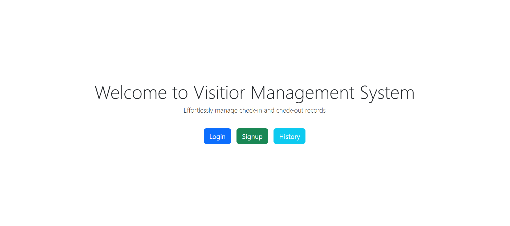

2. **Login Page**
   - For Approver and Security roles.
   - Inputs: Username and Password.
   - 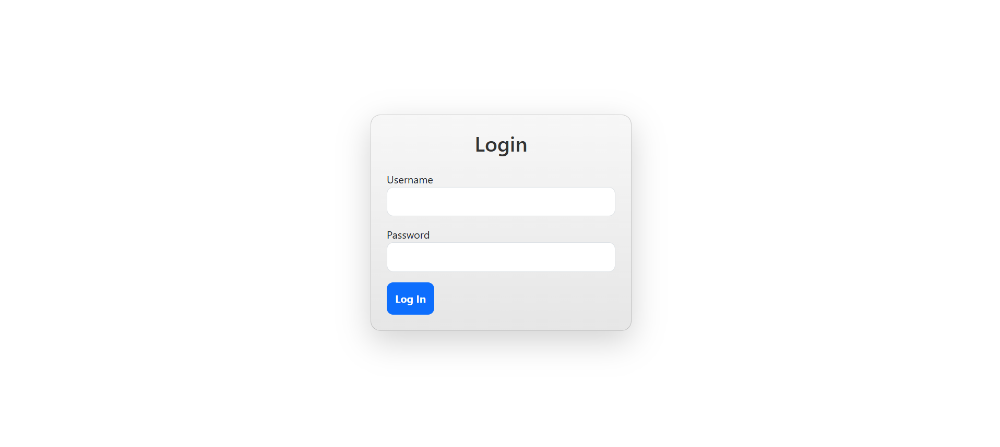

3. **Signup Page**
   - For new Security or Approver accounts.
   - Inputs: Username, Password, and Role.
   - 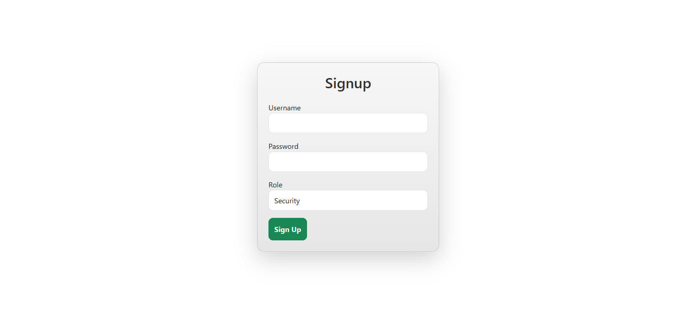

4. **Approver Page** (Secured Route)
   - Two tabs: 
     - **Check-In Requests**
     - 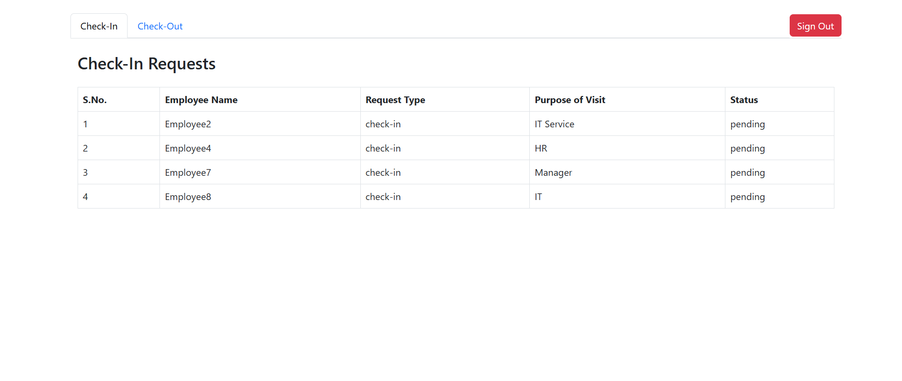
     - **Check-Out Requests**
     - 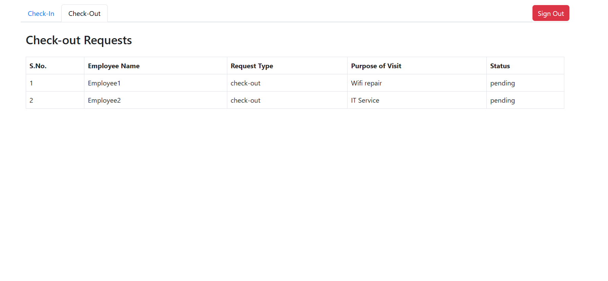
   - Each tab shows a table with relevant details.
   - Modals allow Approvers to accept or reject requests.
   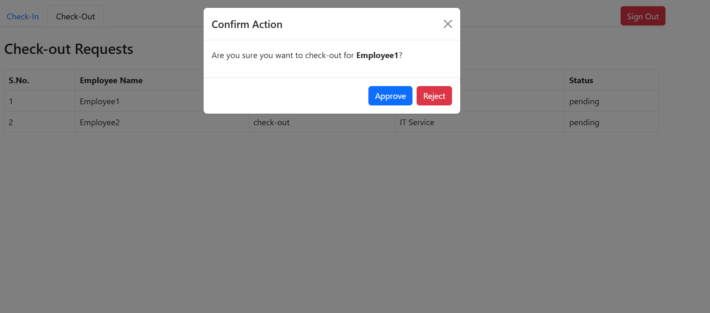

5. **Security Page** (Secured Route)
   - Three tabs:
     - **Pending Requests:** Displays all pending/rejected requests.
     - 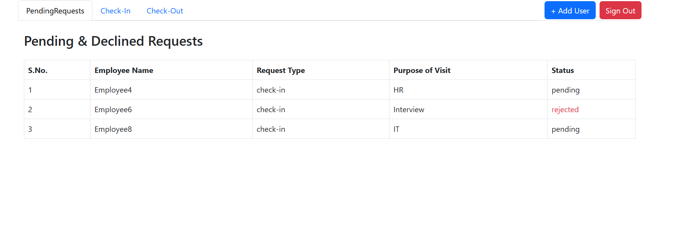
     - **Check-In Requests:** Approved requests with an action button to process check-ins.
     - 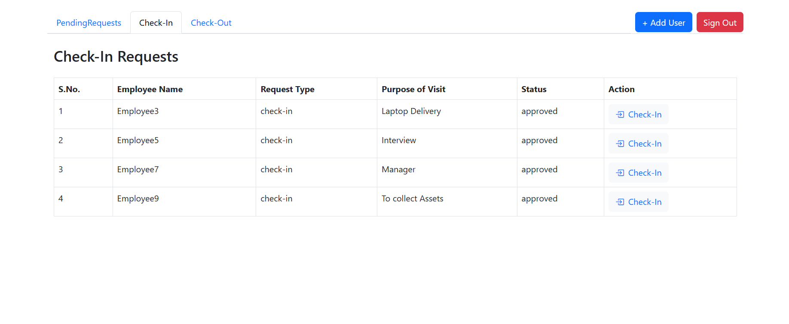
     - **Check-Out Requests:** Displays checked-in requests or approved check-out requests for processing.
     - 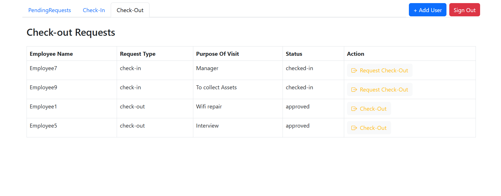
6. **History Page**
   - Employee table with CRUD operations.
   - Displays all requests made by a specific employee upon selection.
   - 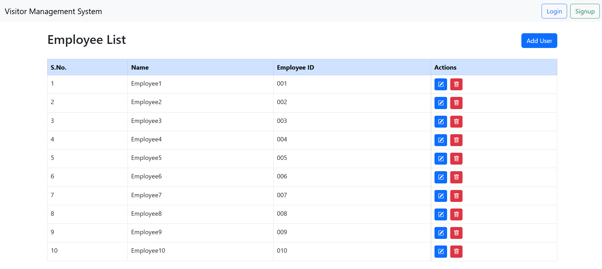
   - 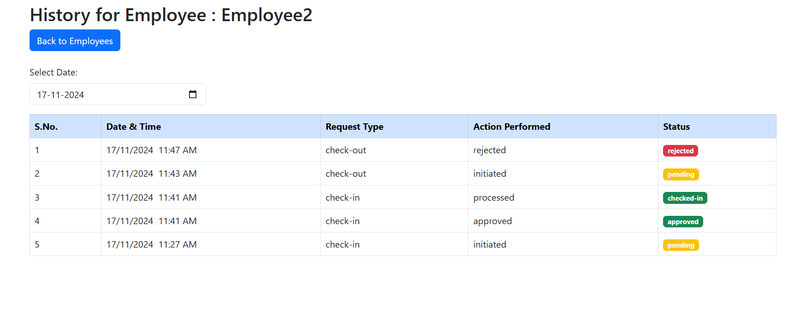

---

## Backend Overview

The backend is implemented using Node.js, Express.js, and MongoDB. It provides the following:

- **Authentication and Authorization**
  - Role-based access for Security and Approver.

- **Data Management**
  - Employee, User, Check-In/Out, and Request History records.

- **Middlewares**
  - Authorization and request history logging.

---

## API Endpoints

### Employee Routes (`/api/employees`)
- `POST /api/employees/` - Create a new employee.
- `GET /api/employees/` - Get all employees.
- `GET /api/employees/:id` - Get an employee by ID.
- `PUT /api/employees/:id` - Update an employee by ID.
- `DELETE /api/employees/:id` - Delete an employee by ID.

### Check-In/Out Routes (`/api/checkInOut`) (Security Only)
- `GET /api/checkInOut/checkIn` - Get approved check-in requests.
- `GET /api/checkInOut/checkedIn` - Get checked-in requests.
- `GET /api/checkInOut/checkout` - Get approved check-out requests.
- `GET /api/checkInOut/pending` - Get pending/rejected requests.
- `POST /api/checkInOut/` - Create a new check-in request.
- `PUT /api/checkInOut/:id` - Process a check-in/check-out request.

### Approver Routes (`/api/approver`) (Approver Only)
- `GET /api/approver/checkIn` - Get check-in requests.
- `GET /api/approver/checkOut` - Get check-out requests.
- `PUT /api/approver/:id` - Approve or reject a request.

### History Routes (`/api/history`) (Public Route)
- `GET /api/history/:employeeId` - Fetch request history for an employee.

---

## Schemas

### User
- **Fields:** `username`, `password`, `role`.
- Used for authentication and authorization.

### Employee
- **Fields:** `employeeName`, `employeeId`.

### CheckInOut
- **Fields:** 
  - `employeeId` (ref: Employee)
  - `requestType` (`check-in`/`check-out`)
  - `status` (`pending`, `approved`, `rejected`, `checked-in`, `checked-out`)
  - `requestBy` (ref: User)
  - `approvedBy` (ref: User)
  - `purposeOfVisit`, `createdAt`.

### RequestHistory
- **Fields:**
  - `employeeId` (ref: Employee)
  - `requestType` (`check-in`/`check-out`)
  - `action` (`initiated`, `approved`, `rejected`, `processed`)
  - `status`
  - `timestamp`, `performedBy` (ref: User).

---

## Middlewares

1. **AuthMiddleware**
   - Provides role-based access control for Check-In/Out and Approver routes.

2. **logHistoryMiddleware**
   - Logs all actions in the RequestHistory schema.

---
